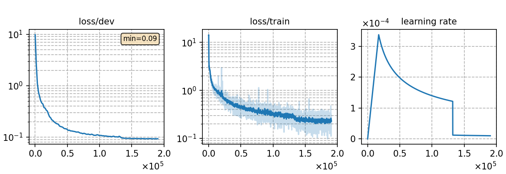

# Monolingual phoneme-based ASR model for Spanish
Author: Ma, Te (mate153125@gmail.com)
### Basic info

This model is built upon `Conformer` architecture and trained using the `CTC` (Connectionist Temporal Classification) approach. The training dataset consists of __382 hours of `Spanish`__ speech data sourced from the publicly available [`Common Voice`](https://commonvoice.mozilla.org/) 11.0.


### Training process

The script [`run.sh`](../../../run.sh) contains the overall model training process.

#### Stage 0: Data preparation
* Follow the steps [`data_prep.md`](../../../local/data_prep.md) and run [`data_prep.sh`](../../../local/data_prep.sh) to prepare the datset and pronunciation lexicon for a given language. The second and fourth stages of `data_prep.sh` involve language-specific special processing, which are detailed in the [`lang_process.md`](../../../lang-process/es/lang_process.md). 
* The detailed model parameters are detailed in [`config.json`](config.json) and [`hyper-p.json`](hyper-p.json). Dataset paths should be added to the [`metainfo.json`](../../../data/metainfo.json) for efficient management of datasets.

#### Stage 1 to 3: Model training
*  The training of this model utilized 3 NVIDIA GeForce RTX 3090 GPUs and took 29 hours.
    * \# of parameters (million): 89.98
    * GPU info
        * NVIDIA GeForce RTX 3090
        * \# of GPUs: 3

* To train the model:

        `bash run.sh es exp/Monolingual/es --sta 1 --sto 3`
* To plot the training curves:

        `python utils/plot_tb.py exp/Monolingual/es/log/tensorboard/file -o exp/Monolingual/es/monitor.png`

|     Monitor figure    |
|:-----------------------:|
||

#### Stage 4: CTC decoding
* To decode with CTC and calculate the %PER:

        `bash run.sh es exp/Monolingual/es --sta 4 --sto 4`

    ##### %PER
    ```
    test_es %SER 42.24 | %PER 2.47 [ 18990 / 769402, 3761 ins, 6451 del, 8778 sub ]
    ```

#### Stage 5 to 7: FST decoding
* For FST decoding, [`config.json`](./lm/config.json) and [`hyper-p.json`](./lm/hyper-p.json) are needed to train language model. Notice the distinction between the profiles for training the ASR model and the profiles for training the language model, which have the same name but are in different directories.
* To decode with FST and calculate the %WER:

        `bash run.sh es exp/Monolingual/es --sta 5`

    ##### %WER
    ```
    test_es_ac1.0_lm0.8_wip0.0.hyp  %SER 38.98 | %WER 7.91 [ 12176 / 153870, 1684 ins, 1791 del, 8701 sub ]
    ```
### Resources
* The files used to train this model and the trained model are available in the following table. 

    | Pronunciation lexicon | Checkpoint model | Language model | Tensorboard log |
    | ----------- | ----------- | ----------- | ----------- |
    | [`lexicon_es.txt`](https://cat-ckpt.oss-cn-beijing.aliyuncs.com/cat-multilingual/cv-lang10/dict/es/lexicon_es.txt) | [`Mono_es_best-3.pt`](https://cat-ckpt.oss-cn-beijing.aliyuncs.com/cat-multilingual/cv-lang10/exp/es/Mono_es_best-3.pt) | [`lm_es_4gram.arpa`](https://cat-ckpt.oss-cn-beijing.aliyuncs.com/cat-multilingual/cv-lang10/dict/es/lm_es_4gram.arpa) | [`tb_es`](https://cat-ckpt.oss-cn-beijing.aliyuncs.com/cat-multilingual/cv-lang10/exp/es/tb_log_es.tar.gz) |